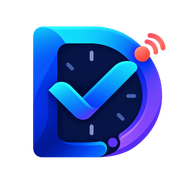

  

<h1 align="center">DamnTodo</h1>

<strong>A calm planner with an unforgiving memory.</strong>

  DamnTodo turns unfinished intentions into realistic sessions, protects progress, and keeps following up until the work is honestly resolved.

## The experience

- A cinematic, sky-backed interface built for desktop and mobile
- Real time-block scheduling with overlap protection
- Long-term roadmaps with independent progress and streaks
- Quiet focus sessions followed by hourly accountability
- Gentle reminders for a nudge; Red Mode for persistent alarms
- Overdue work stays visible until midnight, then returns as next-day backlog
- User-chosen backlog retry time with a 09:00 default
- High-priority recovery for unfinished Red Mode work
- Separate Google Keep-style plans and checklists with no alarms
- Selective completed-task cleanup without deleting scheduled sessions
- Persistent views, scroll position, tasks, plans, and settings

## Private by design

DamnTodo has no account requirement and no task-data backend. Planner data stays in the device's offline database. The installable PWA provides a focused app experience; the Capacitor Android build adds operating-system local notifications and exact-alarm support where permission is granted.

## Built with

Next.js 16 · React 19 · TypeScript · Motion · shadcn/ui · Magic UI · Capacitor Android

## Ownership

DamnTodo is proprietary software. Public visibility does not grant permission to copy, run, modify, redistribute, host, rebrand, train AI on, or create derivatives from this repository. See [LICENSE](./LICENSE).

---

<strong>Plan honestly. Finish deliberately.</strong>

